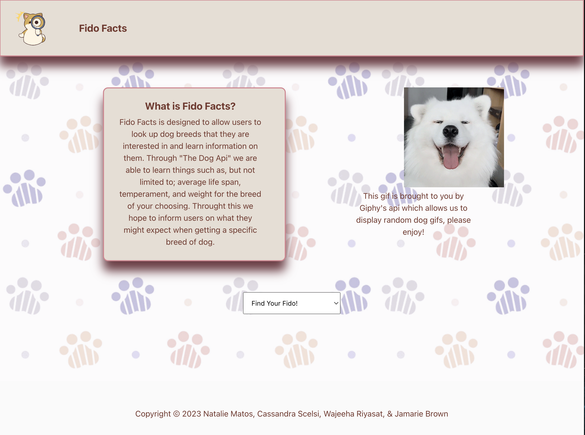
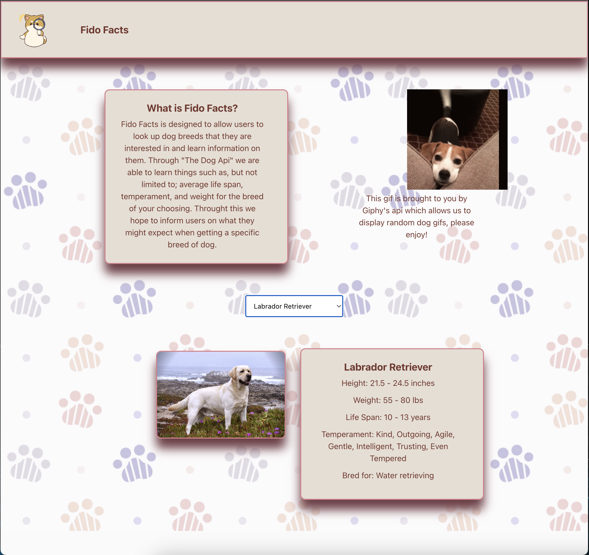

# FIDO FACTS
 
## Description
Fido Facts is a web app that provides facts about dog breeds.  Our motivation to create Fido Facts was to help dog lovers wanting to adopt to be able to select the best dog breed to fit their lifestyle and preferences.  Fido Facts allows users to visit one website to learn about over 170 dog breeds rather than having to look up each individual breed on a different site.

It was challenging to learn how to work with a new CSS framework, how to work with APIs, and how to work together as a development team.  However, we were able to learn from these challenges in order to deploy a successful web app.
  
## Installation
N/A

## Usage
Select a breed from the drop down menu.

Once you have selected a breed, you can view facts about that breed and a corresponding photo!

## Credits

### Resources
- https://thedogapi.com
- https://www.youtube.com/watch?v=as9Y5WcTvdM
- https://www.youtube.com/watch?v=0gmDnS7fEBY
- https://www.youtube.com/watch?v=tJOJPealurs
- https://stackoverflow.com/questions/10929586/what-is-the-difference-between-for-and-foreach
- https://www.youtube.com/watch?v=jHknLp5iBRo
- https://bulma.io/documentation/columns/basics/
- https://youtu.be/LBzZLzu2GKo
- https://www.youtube.com/watch?v=HRh6zHRwRLo
- https://developers.giphy.com/
- https://www.youtube.com/watch?v=ASw6rc289VI
- https://developer.mozilla.org/en-US/docs/Web/JavaScript/Reference/Global_Objects/Array/find 
- https://stackoverflow.com/questions/43219242/how-to-edit-text-style-with-javascript 
- https://ugokawaii.com/en/illustration-for-presentation-en/explanation-en/interesting-facts/

### Contributors
- Natalie Matos: https://github.com/nmatos12
- Wajeeha Riyasat: https://github.com/WajhR
- Jamarie Brown: https://github.com/Azurebrown

## License
MIT License

## Deployed Application Link
https://scelsic2.github.io/fido-facts/
